## SeaweedFS


1. Install SeaweedFS (for filer metadata store, need mariadb installed with `sw_database` database and `filemeta` table and a user with suitable privileges)

   ```bash
   helm repo add seaweedfs https://seaweedfs.github.io/seaweedfs/helm
   
   helm show values seaweedfs/seaweedfs > seaweed_values.yaml
   
   nano seaweed_values.yaml
   
   helm upgrade --install seaweed seaweedfs/seaweedfs   --namespace seaweedfs   --create-namespace -f seaweed_values.yaml
   ```

   ```yaml
   # seaweed_values.yaml
   global:
     enableReplication: true
   	# 1 main + 1 replica, 1/3 node down, new data will be written in 2 nodes left
     replicationPlacement: "001" 
   filer:
     enabled: true
     replicas: 3
     data:
       type: "hostPath"
       size: ""
       storageClass: ""
       hostPathPrefix: /storage
     extraEnvironmentVars:
       WEED_MYSQL_ENABLED: "true"
       WEED_MYSQL_HOSTNAME: "mariadb.nmaa.svc.cluster.local"
       WEED_MYSQL_PORT: "3306"
       WEED_MYSQL_DATABASE: "sw_database"
       WEED_MYSQL_CONNECTION_MAX_IDLE: "5"
       WEED_MYSQL_CONNECTION_MAX_OPEN: "75"
       # "refresh" connection every 10 minutes, eliminating mysql closing "old" connections
       WEED_MYSQL_CONNECTION_MAX_LIFETIME_SECONDS: "600"
       # enable usage of memsql as filer backend
       WEED_MYSQL_INTERPOLATEPARAMS: "true"
       # if you want to use leveldb2, then should enable "enablePVC". or you may lose your data.
       WEED_LEVELDB2_ENABLED: "false"
       # with http DELETE, by default the filer would check whether a folder is empty.
       # recursive_delete will delete all sub folders and files, similar to "rm -Rf"
       WEED_FILER_OPTIONS_RECURSIVE_DELETE: "false"
       # directories under this folder will be automatically creating a separate bucket
       WEED_FILER_BUCKETS_FOLDER: "/buckets"
     secretExtraEnvironmentVars:
       WEED_MYSQL_USERNAME:
         secretKeyRef:
           name: mariadb-secret
           key: mysql_user
       WEED_MYSQL_PASSWORD:
         secretKeyRef:
           name: mariadb-secret
           key: mysql_password
   master:
     replicas: 3
     volumeSizeLimitMB: 1000
     # BACKUP PROCESS TO LOCAL
     # sidecars:
     # - name: backup-filer-process
     #   image: chrislusf/seaweedfs:3.85
     #   command: 
     #   - sh
     #   - -c
     #	  - |
     #	    echo "[INFO] Generating replication.toml"
     #	  	cat <<EOF > replication.toml
     #     [sink.local]
     #     enabled = true
     #     directory = "/data/backup"
     #     is_incremental = false
     #     EOF
     #	    echo "[INFO] Starting filer backup process"
     #	    weed filer.backup -filer $WEED_CLUSTER_SW_FILER -doDeleteFiles
     #   env:
     #   - name: WEED_CLUSTER_SW_FILER
     #	 	value: seaweedfs-filer-client.seaweedfs:8888
     #	  volumeMounts:
     #   - name: data-seaweedfs
     #     mountPath: /data
     data:
       type: "hostPath"
       storageClass: ""
       hostPathPrefix: /ssd
   volume:
     replicas: 3
     dataDirs:
     - name: data1
       type: "hostPath"
       hostPathPrefix: /ssd
       maxVolumes: 0 # If set to zero on non-windows OS, the limit will be auto configured. (default "7")
   ```

   

2. Expose Filer Node Port:

   ```bash
   k expose pod seaweedfs-filer-0 --type NodePort --name seaweedfs-filer-np -n seaweedf
   ```

   

4. Install SeaweedFS CSI

   ```bash
   helm repo add seaweedfs-csi-driver https://seaweedfs.github.io/seaweedfs-csi-driver/helm
   
   helm show values seaweedfs-csi-driver/seaweedfs-csi-driver > seaweedfs_csi_values.yaml
   
   nano seaweedfs_csi_values.yaml
   
   helm upgrade --install seaweedfs-csi seaweedfs-csi-driver/seaweedfs-csi-driver   --namespace seaweedfs   --create-namespace -f seaweedfs_csi_values.yaml
   ```
   
   ```yaml
   # seaweedfs_csi_values.yaml
   seaweedfsFiler: seaweedfs-filer.seaweedfs.svc.cluster.local:8888
   controller:
     replicas: 3
   ```
   
   

4. Test CSI

```yaml
# nmaa-pvc.yml
apiVersion: v1
kind: PersistentVolume
metadata:
  name: nmaa
spec:
  capacity:
    storage: 5Gi
  accessModes:
    - ReadWriteMany
  persistentVolumeReclaimPolicy: Delete
  storageClassName: seaweedfs-storage
  csi:
    driver: seaweedfs-csi-driver
    volumeHandle: nmaa
---
apiVersion: v1
kind: PersistentVolumeClaim
metadata:
  name: nmaa-pvc
  namespace: seaweedfs
spec:
  accessModes:
    - ReadWriteMany
  resources:
    requests:
      storage: 5Gi
  storageClassName: seaweedfs-storage
  volumeName: nmaa
```

```yaml
# test_deploy_3_rep_nmaa.yml
apiVersion: apps/v1
kind: Deployment
metadata:
  name: ha-app
  namespace: seaweedfs
spec:
  replicas: 3
  selector:
    matchLabels:
      app: ha-app
  template:
    metadata:
      labels:
        app: ha-app
    spec:
      containers:
        - name: test
          image: ubuntu:22.04
          command: ["sh", "-c", "sleep 36000"]
          volumeMounts:
            - name: shared-volume
              mountPath: /data
      volumes:
        - name: shared-volume
          persistentVolumeClaim:
            claimName: nmaa-pvc
```

```bash
k apply -f test_deploy_3_rep_nmaa.yml,nmaa-pvc.yml
```


#### Objectives:

1. High Availability (HA)

   - Data is always distributed to 3 nodes

   - Each one always has 1 replica (need min 2/3 nodes available)

   - If there is only 1 node avalable (not enough for replication), seaweedfs will restrict write operator (read-only data) https://github.com/seaweedfs/seaweedfs/discussions/2312

   - Volume is only used for storing data, the metadata need to be kept in a metadata store (default is local leveldb2 - not good for HA)

   - `lock`: prevent multiple processes run at them same time
     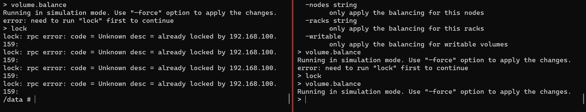

   - `volume.balance` (need lock first, use `-force` to apply the changes): 
     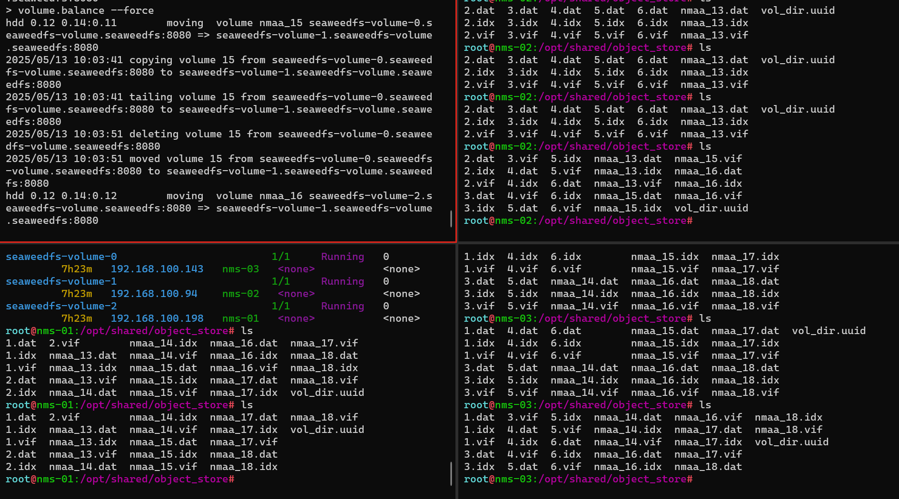

   - `volume.fix.replication` (-force to apply the changes - need lock first if force): 
     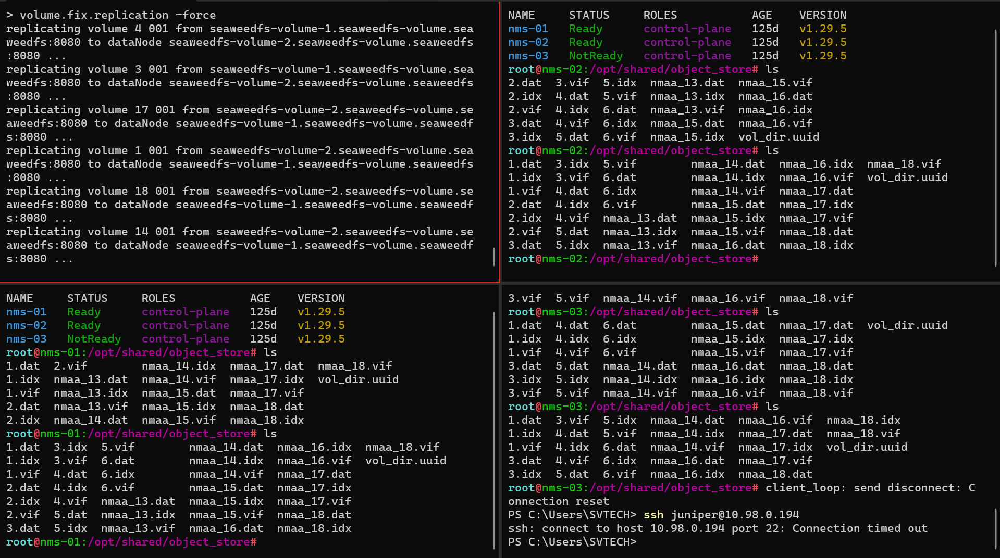
     - When node up again, there are some data have 3 replicas => run fix.replication => remove extra reps

2. I/O Performance

   - Current status: 1 deployment 3 replicas, 1 pvc

     - 3 nodes k8s (3 volume servers), 100gb hdd

     - Max volume each volume server: auto configured
     - Max volume size: 1gb
   
   - Run fio on pod:
   
     ```bash
     apt update && apt install -y fio
     
     # sequential write
     fio --name=write-test --filename=/mnt/test/testfile --size=1G --bs=1M --rw=write --ioengine=libaio --direct=1
     
     # random read
     fio --name=read-test --filename=/mnt/test/testfile --size=1G --bs=4k --rw=randread --ioengine=libaio --direct=1
     
     # random write
     fio --name=randwrite-test --filename=/mnt/test/testfile --size=1G --bs=4k --rw=randwrite --ioengine=libaio --direct=1
     
     ```


   						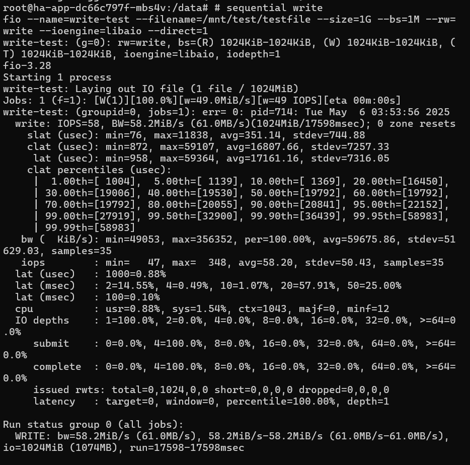
   	
   						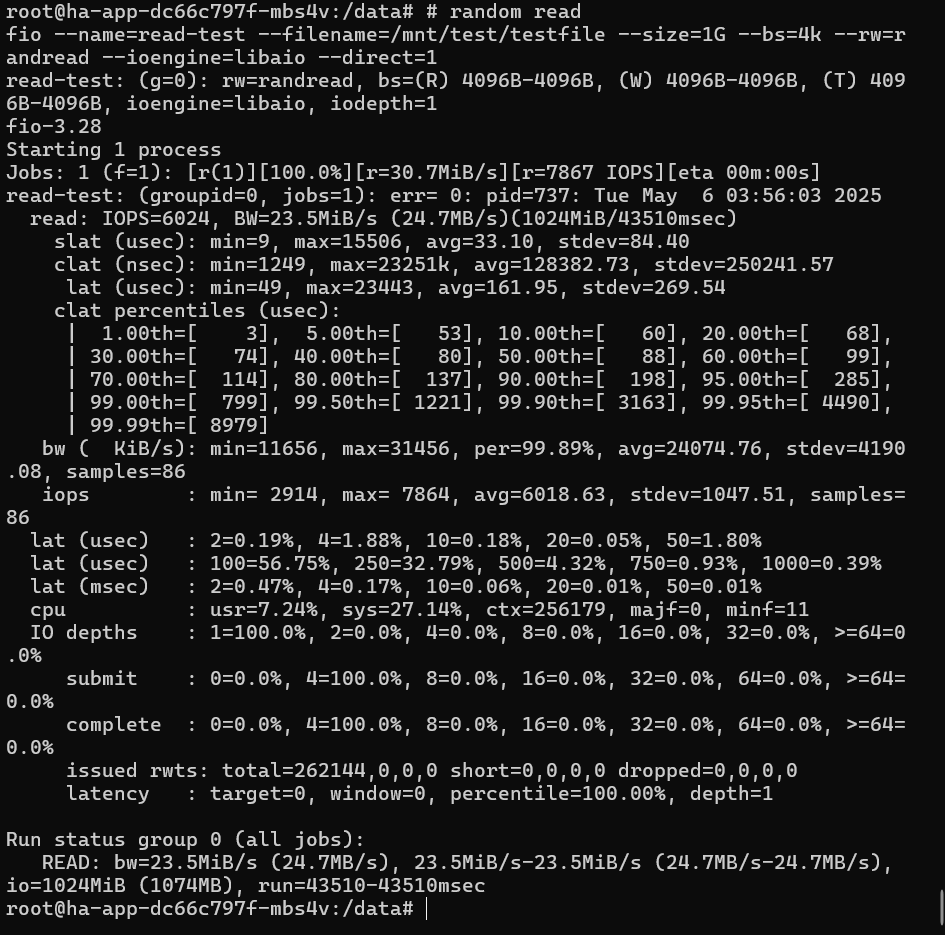
   	
   						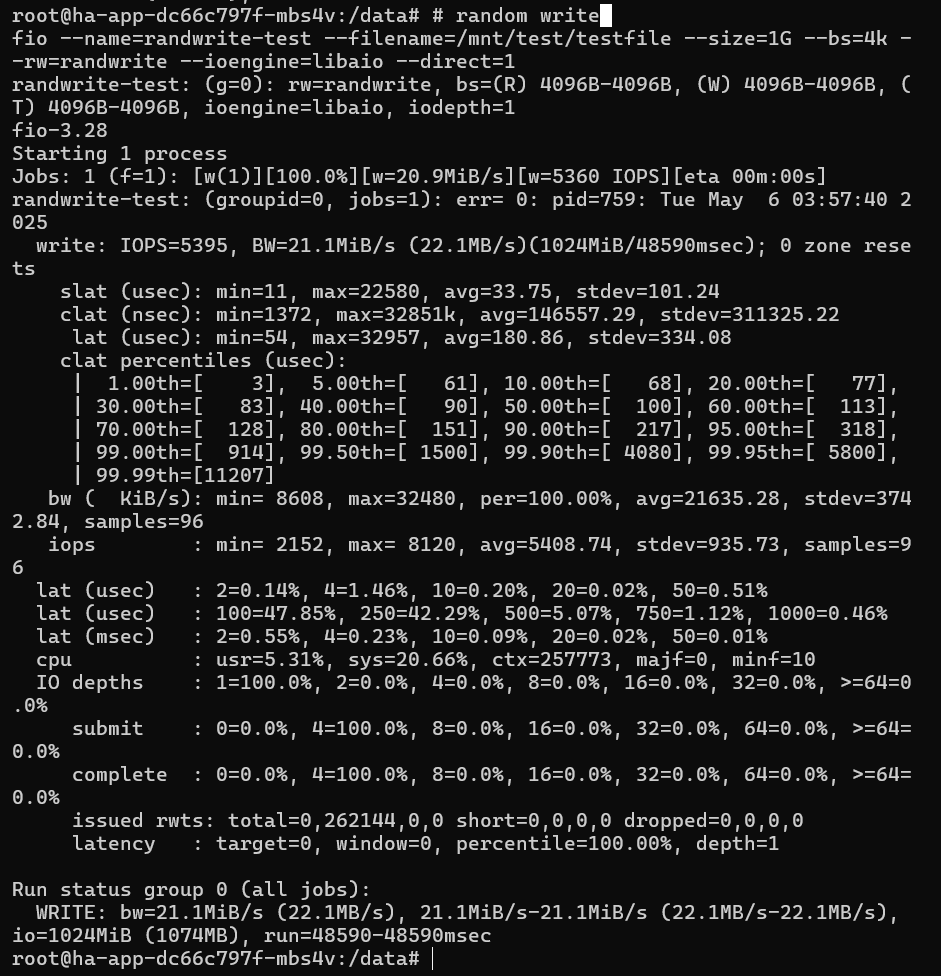

- Run fio on disk

  ​					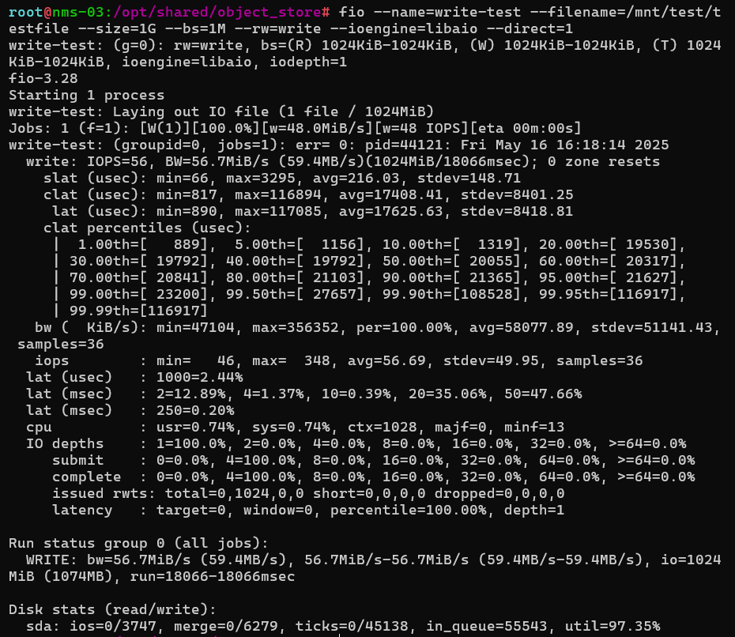		

​						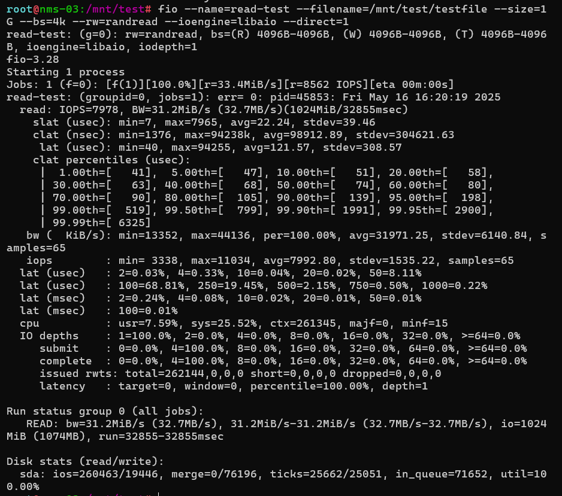

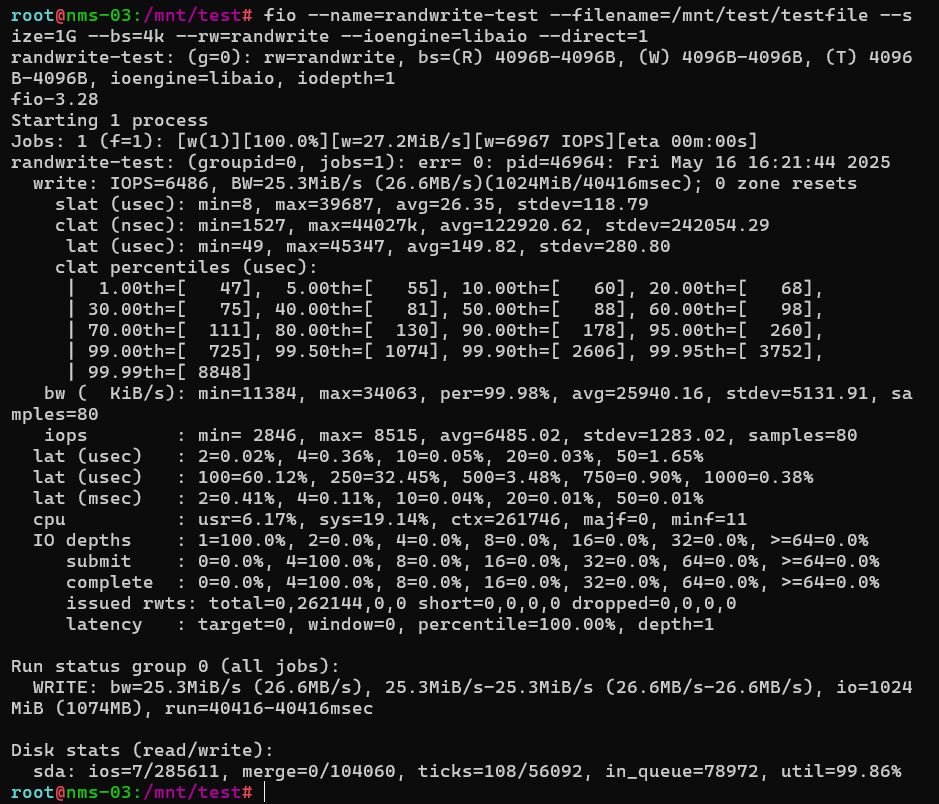

3. API Support for File Operations

   https://github.com/seaweedfs/seaweedfs/wiki/Master-Server-API

   https://github.com/seaweedfs/seaweedfs/wiki/Volume-Server-API

   https://github.com/seaweedfs/seaweedfs/wiki/Filer-Server-API

   

4. Backup and Recovery
   - Backup folders and files under filer dir (including meta data) 
     https://github.com/seaweedfs/seaweedfs/wiki/Async-Backup

     ```bash
     # filer server
     weed scaffold -config=replication -output=.
     weed filer.backup
     ```

     ```toml
     # replication.toml
     [sink.local]
     enabled = true
     directory = "/data"                                                  
     # all replicated files are under modified time as yyyy-mm-dd director# so each date directory contains all new and updated files.         
     is_incremental = false                                                  
     ```

     ```bash
     weed filer.copy ./path/to/folder_or_file http://filer_server:8888/
     ```

     

   - Backup filer metadata store

     https://github.com/seaweedfs/seaweedfs/wiki/Async-Filer-Metadata-Backup

     ```bash
     # filer server
     weed scaffold -config=filer -output=.
     weed filer.meta.backup
     ```

     ```toml
     # filer.toml
     [mysql]  # or memsql, tidb
     # CREATE TABLE IF NOT EXISTS `filemeta` (
     #   `dirhash`   BIGINT NOT NULL       COMMENT 'first 64 bits of MD5 hash value of directory field',
     #   `name`      VARCHAR(766) NOT NULL COMMENT 'directory or file name',
     #   `directory` TEXT NOT NULL         COMMENT 'full path to parent directory',
     #   `meta`      LONGBLOB,
     #   PRIMARY KEY (`dirhash`, `name`)
     # ) DEFAULT CHARSET=utf8mb4 COLLATE=utf8mb4_bin;
     
     enabled = false
     # dsn will take priority over "hostname, port, username, password, database".
     # [username[:password]@][protocol[(address)]]/dbname[?param1=value1&...&paramN=valueN]
     dsn = "root@tcp(localhost:3306)/seaweedfs?collation=utf8mb4_bin"
     hostname = "localhost"
     port = 3306
     username = "root"
     password = ""
     database = ""              # create or use an existing database
     connection_max_idle = 2
     connection_max_open = 100
     connection_max_lifetime_seconds = 0
     interpolateParams = false
     # if insert/upsert failing, you can disable upsert or update query syntax to match your RDBMS syntax:
     enableUpsert = true
     upsertQuery = """INSERT INTO `%s` (`dirhash`,`name`,`directory`,`meta`) VALUES (?,?,?,?) AS `new` ON DUPLICATE KEY UPDATE `meta` = `new`.`meta`"""
     ```

     

   - Backup volume data (manual backup data by volume ID):

     https://github.com/seaweedfs/seaweedfs/wiki/Data-Backup

     

   - Backup PVC

     https://github.com/seaweedfs/seaweedfs/wiki/Kubernetes-Backups-and-Recovery-with-K8up

     

5. Others

   1. maxVolumes: 0 => auto configured as free disk space divided by volume size, if not set: 8 
   
   2. `volume.dataDirs[0].maxVolumes: 2` & `master.volumeSizeLimitMB: 1000` => exceed the limit => stop write
      - upload file 14mb  => 3 volume ids created (2 each node)
      - 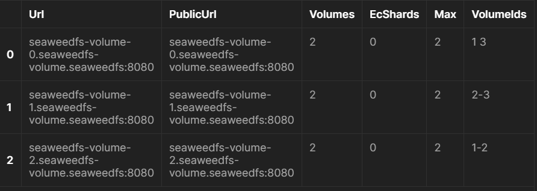
   
   3. `volume.dataDirs[0].maxVolumes: 2` & `master.volumeSizeLimitMB: 1`
      - upload file 14mb => 3 volume ids created (2 each node) => stop write (cannot upload since master check volumeSizeLimit)
   4. Whenever a file uploaded to pvc, it create a volume id which includes the name of the pv as prefix name (remember to have enough resource or the write operator will be restricted)
   5. Use `volume.delete -node seaweedfs-volume-2.seaweedfs-volume.seaweedfs:8080 -volumeId 60` to delete volume. To delete all volumes, clean all data from all host then helm reinstall. To delete only all data: volume.vacuum or api /vacuum


6. Test
   1. Current Status:
      - 3 nodes k8s (3 volume servers), 100gb hdd
      - Max volume each volume server: auto configured
      - Max volume size: 1gb
      
   2. Test 
      - HA
        - Auto `volume.fix.replication` and `volume.balance`
          ```yaml
          apiVersion: batch/v1
          kind: CronJob
          metadata:
            name: auto-fix-rep-and-balance
            namespace: seaweedfs
          spec:
            schedule: "*/30 * * * *"
            successfulJobsHistoryLimit: 1
            failedJobsHistoryLimit: 1
            jobTemplate:
              spec:
                template:
                  spec:
                    containers:
                    - name: fix-replication-and-balance
                      image: chrislusf/seaweedfs:3.85
                      command:
                        - sh
                        - -c
                        - |
                          echo "[INFO] Volume List Before Fixing and Balancing"
                          echo "volume.list" | weed shell -master $WEED_CLUSTER_SW_MASTER
                          echo "[INFO] Start Fixing Replication..."
                          echo "lock; volume.fix.replication -force -doDelete false; unlock" | weed shell -master $WEED_CLUSTER_SW_MASTER
                          echo "[INFO] Start Balancing Volume..."
                          echo "lock; volume.balance -force; volume.list unlock" | weed shell -master $WEED_CLUSTER_SW_MASTER;
                          echo "[INFO] Volume List After Fixing and Balancing"                 	   echo "volume.list" | weed shell -master $WEED_CLUSTER_SW_MASTER
                          echo "[INFO] Done"
                      env:
                        - name: WEED_CLUSTER_SW_MASTER
                          value: "seaweedfs-master.seaweedfs:9333"
                    restartPolicy: Never
          ```
        
          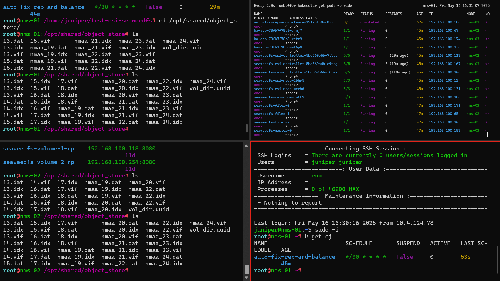
        
      - Scalability: add volume server, increase volume replica, master api pre allocate volumes to add volume data.
      
      - Auto backup: add sidecars container in master pod
      
      - Race condition risk (2 app write to the same PV)

